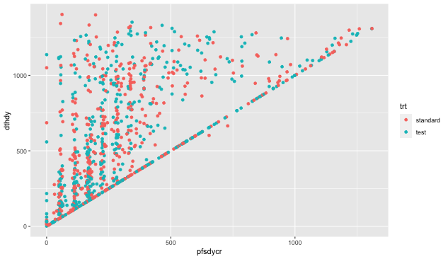
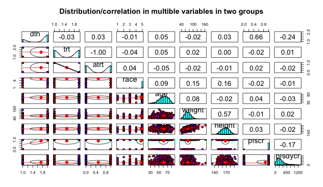
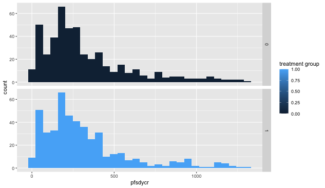
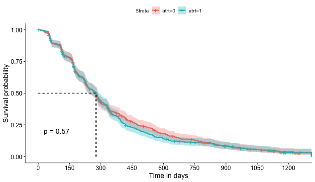
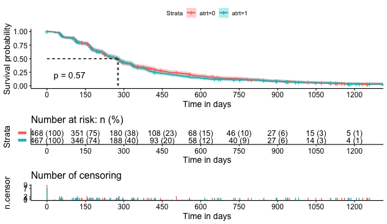

# Survival-Analysis-NCT00364013
This is a created R package for survival analysis of NCT00364013. To use this package please first library the package in console.
```r
library(NCT00364013)
```

## Summary

**Structure of the document:**

1.  A description of the study
2.  Load data and packages
3.  Exploratory Data Analysis
4.  Intuition about the survival theories
5.  Kaplan-Meier Analytics
6.  Cox proportional hazard models
7.  Conclusion\

## 1. A description of the study

The primary purpose of the study is to assess whether panitumumab in combination with infusional 5-fluorouracil, leucovorin, and oxaliplatin (FOLFOX) chemotherapy improves progression-free survival (PFS) compared to FOLFOX alone as first-line therapy for metastatic colorectal cancer (mCRC) among subjects with wild-type KRAS tumors (subjects whose tumors contain nonmutated KRAS) and subjects with mutant KRAS tumors. In this study, participants are randomized in a 1:1 ratio to first-line therapy consisting of either:

• Arm 1(test): FOLFOX with panitumumab or

• Arm 2(standard): FOLFOX alone

Subjects will complete an EQ-5D every 4 weeks ± 1 week, starting at baseline and continuing while receiving assigned study treatment until disease progression and once at the safety followup visit. If withdrawal from assigned study treatment occurs prior to disease progression (eg due to unacceptable toxicities) subjects should continue to complete the EQ-5D every 8 weeks ± 1 week until disease progression. Researchers did primary analysis, safety interim analyses and efficacy interim analyses in this study to evaluate the combined drug efficiency.

## 2. Load data and packages
To avoid repeated data manipulation, here I **did not** save all .sas7bat files in the package, so the code here is a little bit different from what we did in the homework 1. In conclusion, I just stored the cleaned and processed data. To see more about our data cleaning process, please review our homework 1.


## 3. Exploratory data analysis

```r
summarize_table(data_cleaned)
```
```
 ATRTFOLFOX.alone ATRTPanitumumab...FOLFOX     dthdy         PRSURGN PRSURGY   dth         age       SEXFemale SEXMale                   trt      B_ECOG  B_ECOGFully.active
 0:468            0:467                    Min.   :  1.0      0:842   0: 93   0:245   Min.   : 1.00   0:579     0:356  FOLFOX alone        :466   0:934   0:415  
 1:467            1:468                    1st Qu.:176.5      1: 93   1:842   1:690   1st Qu.:29.00   1:356     1:579  Panitumumab + FOLFOX:469   1:  1   1:520 
                                           Median :323.0                              Median :36.00                                                          
                                           Mean   :331.4                              Mean   :34.98   
                                           3rd Qu.:494.0                              3rd Qu.:43.00                                                         
                                           Max.   :657.0                              Max.   :58.00                                                                                                            
 B_ECOGIn.bed.less.than.50..of.the.time   B_ECOGSymptoms.but.ambulatory pfscr      pfsdycr  
 0:889                                    0:567                         0:124   Min.   :  1.0  
 1: 46                                    1:368                         1:811   1st Qu.: 91.0 
                                                                                Median :186.0  
                                                                                Mean   :203.7 
                                                                                3rd Qu.:318.5  
                                                                                Max.   :466.0  
```

From the brief summary we can see that:

-   61.93% of patients are women;

-   73.8% of patients died before the end; of the study, and the mean of survival period is 331.4;

-   Age ranges from 1 to 58 years old ;

-   90.05% of the subjects had a prior surgery ;

-   Patient status: 55.61% of the subjects are fully active, 5.92% of the subjects are in bed less than 50% of their time, and 39.36% of the subjects have symptoms but ambulatory.

To get a basic sense of the relationship among different variables, we drew the following graph.

```r
plot_trt(tmp)
```
 

```r
plot_panels(tmp)
```


We explored the relationship between the experimental group's and the control group's dthdy, race, age, weight, height and pfsdycr. The upper right part contains correlation values, graphs on the diagonal line is the data distribution histograms, and the lower left part shows the corresponding scatter plots. The red and purple points are the data of the experimental group and the control group respectively. From the figure, we could see that there is no correlation between other variables except for the dthdy and pfs.

Below we will begin to analyze the dthdy and pfs(progression-free survival) of the two groups.

```r
plot_hist(tmp)
```


We noticed that there isn't clear difference in PFS days and death days between test or standard treatment groups. Also, we did not find any significant difference in death days between test or standard treatment groups.

**State a concise hypothesis?**

Our hypothesis is that:

Panitumumab with FOLFOX chemotherapy **DOES NOT** improve progression-free survival (PFS) and Overall Survival (OS) rate compared to FOLFOX alone as first-line therapy for metastatic colorectal cancer (mCRC) among subjects with wild-type KRAS tumors (subjects whose tumors contain nonmutated KRAS) and subjects with mutantKRAS tumors.

Here, we plan to use survival analysis tools to test our hypothesis as follows.

## 4. Survival analysis

Survival analysis helps when the time element (an event occuring) is taken into account. We want to estimate the time to reach a specific event with survival analysis. In our study, if there is no obvious difference in estimated progression-free survival and overall survival signal between Arm1 and Arm2, then our hypothesis is TRUE.

### 4.1. Event

The event is the endpoint in the study, the specific outcome we want to measure. In our study what we want to estimate is the death or survival situations among patients in arm1 or arm2.

### 4.2. Censored Data

This refers to incomplete data, the event did not occur for a subject during the time of the study, there are several cases:

-   Patient did not experience any event during the study, and we do not know if the event occured (for instance, we do not know if the patient ultimately survived or not after the study).

-   Right censored subjects: the patient withdrew from the trial or data is lost for some reason (follow-up didn't occur on the patient, or the patient experienced a different event).

All patients not experiencing the event during the time of the study will be censored at the latest recorded time point.

### 4.3 Kaplan-Meier

**Main purpose: visualzing survival curves, works well with categorical data, for numerical data we'll use the Cox proportional hazard models.**

Kaplan-Meier statistic measures the probability that a patient will survive past a specific point in time. At , the statistic is 1 (or 100%). When  increases infinitely, the statistic becomes 0.

The plot of the KM estimator is a series of decreasing horizontal steps, approaching the true survival function.

The **survival probability** of surviving after time = t is noted ). It is the product of all the prior survival probabilities up to time = t.


The basic formula is:


) is a time when at least an event happened, ) is the number of events (death or recurring disease for instance), that happened at time ), ) is the number of of individuals that survive (did not have an event or where not censored).
Source: <https://en.wikipedia.org/wiki/Kaplan%E2%80%93Meier_estimator>

This is based on conditional probabilities, each new proportion conditional on the previous proportions.

### 4.4. Log-Rank Test

This test is performed on the curves of the Kaplan-Meier method.\
For two (or more) different survival curves, it tests the null hypothesis that both curves are equal. If the p-value is below the significance level (generally ), then we have convincing statistical evidence that at least two curves differ.

### 4.5. Cox proportional hazard models

**Main purpose: describing the simultaneous effect of several variables on the rate of a particular event happening at a specific point in time.**

The Cox model is defined with the hazard function, (http://latex.codecogs.com/svg.latex?h(t)): it describes the probability of a hazard of a subject to survive to time = $t$. The function returns a proportion, from 0 to 1.

It measures the instanteous risk of death. It has a memory-less property, the likelihood of something happening at time = $t$ has no relation to what happened in the past. The function at year y applies to all subjects alive that year, without taking into account who died in previous years.

Covariates are the predictors we use in the model that looks pretty much like a multiple linear regression.

Hazard function:


-    = survival time
-   ) = hazard function taking as arguments n covariates noted
     to 
-   , …,  = coefficients or weights of each covariate
-    = baseline hazard, i.e. value of the hazard when all x's are
    equal to zero.
-   Hazard ratios ) are noted HR:
    if : no effect
    if : reduction in hazard, we call the associated covariate a good prognostic factor
    if : increase in hazard, we call the associated covariate a bad prognostic factor

### 4.6. Difference between survival and hazard functions

The survivor function describes the probability of "not having an event", whereas the hazard function describes the probability of the event occurring.

The survival function is the probability that a subject survives from the time origin of the study to a specified future time .

The hazard function is the probability that a subject under observation at a time $t$ has an event at that time.

## 5. Kaplan-Meier Analytics

We want to fit a survival curve for time until the event on the x-axis and status on the y-axis, with an explanatory variable like gender, type of treatment, ...

### 5.1. Fitting a Kaplan-Meier Model

We use the `survfit()` function from the survival package, in combination with the `Surv()` function, which provides a survival object containing failure time and censoring information. I encapsulated the code into a function named survival_fit, and here I directly use it.

In this first example, we use the treatment class (standard or test):

```{r}
survival_fit(tmp)
```
```
       records n.max n.start events   *rmean *se(rmean) median         0.95LCL 0.95UCL
atrt=0     468   468     468    403 367.6323   15.04755    275  atrt=0     239     286
atrt=1     467   467     467    408 353.5541   14.58030    279  atrt=1     239     292

Call: survfit(formula = Surv(pfsdycr, pfscr) ~ atrt, data = tmp)

         n events median 0.95LCL 0.95UCL
atrt=0 468    403    275     239     286
atrt=1 467    408    279     239     292
```

The short summary above shows that test treatment group has 403 events and standard group has 408 events, with a median survival time of 275 days for the test treatment group and 279 days for the standard group.403 vs. 408 events, 275 vs. 279 pfs days, from which we almost cannot tell the difference in PFS and OS between test treatment group and standard treatment group!

However, we need to visualize our model and calculate the p-value to further illustrate and test our hypothesis, as shown in the following section.

### 5.2. Visualizing the model
We use the `plot_survival` function from my package to fit a cox model. This function calls `ggsurvplot()` from Survminer, which offers more options in just one plot.

```{r}
plot_survival(survival_fit(tmp))
```



Interpretation:

-   The x-axis represents **the survival time in days**.

-   The y-axis shows **the probability of survival time**, related to the number of days on the x-axis.

-   Each event (death in this case) is shown by a vertical drop of the curve.\
    Vertical ticks (although hardly noticeable on the plot) show a censored patient.

-   The curve always start at 1 (no events occured or in this case all patients are alive), then decreases and if the study would last infinitely, the curve would tend towards 0 (no subjects left due to event or censoring).

-   The **p-value=0.76 in PFS estimation model**, which is both extremely high, we fail to reject the null hypothesis that both curves are different.

-   In our hypothesis, there is no statistical evidence that both curves are different or, the treatment type doesn't impact the survival time, i.e. our hypothesis holds.

-   Like stated earlier and visible here, the median survival time (the point where survival probability is 0.5) for standard treatment is 279 days, against only 275 days for the test treatment. There is no statistical evidence that both curves are different.

## 6. Cox proportional hazard models

### 6.1. Fitting a Cox Model

We use the `summarize_cox` function from my package to fit a cox model. This function calls `coxph()` function from the survival package, can also contain some other data processing code.

**Fit univariate model**

```{r}
summarize_cox(tmp)
```
```
Call:
coxph(formula = Surv(pfsdycr, pfscr) ~ atrt, data = tmp_d)

        coef exp(coef) se(coef)     z     p
atrt 0.04000   1.04081  0.07032 0.569 0.569

Likelihood ratio test=0.32  on 1 df, p=0.5695
n= 935, number of events= 811 
```

Interpreting the summary output:

-   **The "z" column gives the Wald statistic value** (ratio of each regression coefficient to its standard error ). The wald statistic evaluates, whether the beta coefficient of a given variable is statistically significantly different from 0. With  and , type of treatment doesn't have any statistically significant coefficients.

**It the regression coefficients (coef) has a positive sign**, the hazard (risk of death) is higher, i.e. the prognosis is worse, for subjects with higher values of that variable. The output gives the hazard ratio (HR) for the second group relative to the first group, that is, test treatment versus standard. The beta coefficient for atrt = 0.04 indicates that test patients have higher risk of death (higher survival rates) than standard patients. But let's keep in mind that the p-value was high and the variable itself is not statistically significant.

**Hazard ratios** , that is the exponentiated coefficients noted 1.04, give the effect size of the covariates. For example, having test treatment increases the hazard by a factor of 1.04.

**The global statistical significance of the model** gives p-values for three tests: likelihood-ratio test, Wald test, and score logrank. These three methods test the null hypothesis that all beta va;ues are zero and are asymptotically equivalent. For large n, they return similar results. For small n, we use the likelihood ratio test.

## 7. Conclusion

After brief exploratory analysis using tables, visualizations and analysis under two survival analysis models. We can say that our hypothesis:

> Panitumumab with FOLFOX chemotherapy **DOES NOT** improve
> progression-free survival (PFS) and Overall Survival (OS) rate
> compared to FOLFOX alone as first-line therapy for metastatic
> colorectal cancer (mCRC) among subjects with wild-type KRAS tumors
> (subjects whose tumors contain nonmutated KRAS) and subjects with
> mutantKRAS tumors.

is **CORRECT**.

